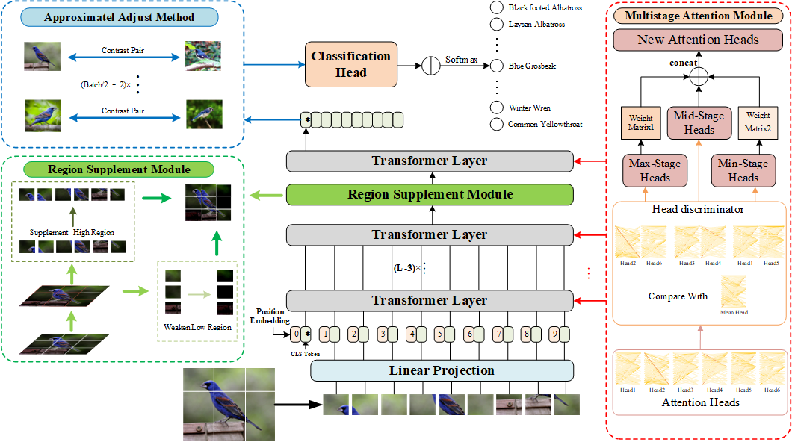

# MARS-Trans: Multistage Attention Region Supplement Transformer for Fine-grained Visual Categorization

An improved model with Vision Transformer as the backbone called MARS-Trans is now used in Fine-grained Visual Categorization.

## Introduction
"MARS-Trans" is a variant model of the Vision Transformer proposed by the Big Data Analysis Lab of the School of Information Engineering, Henan University of Science and Technology.

